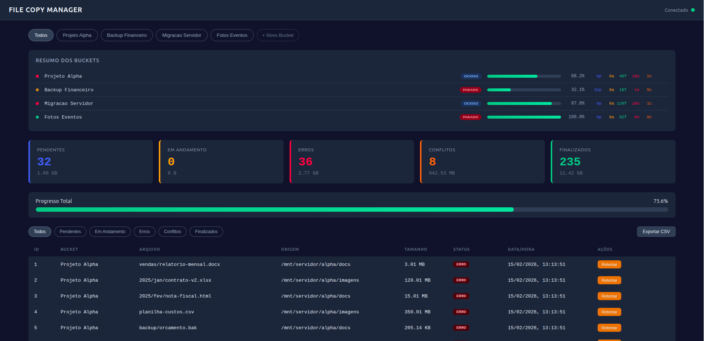
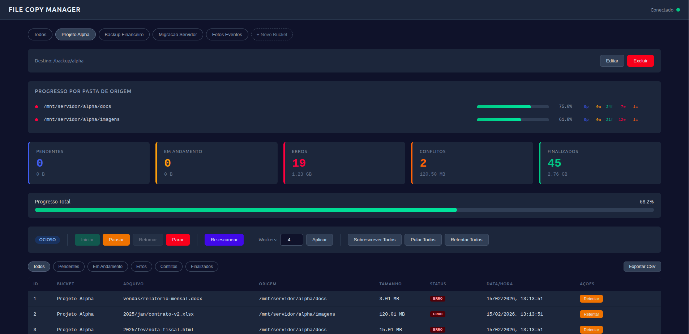
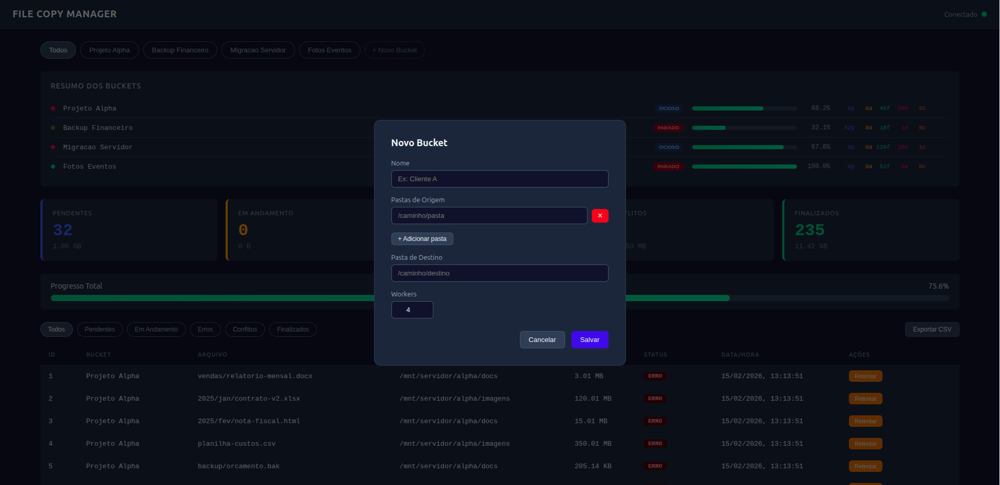
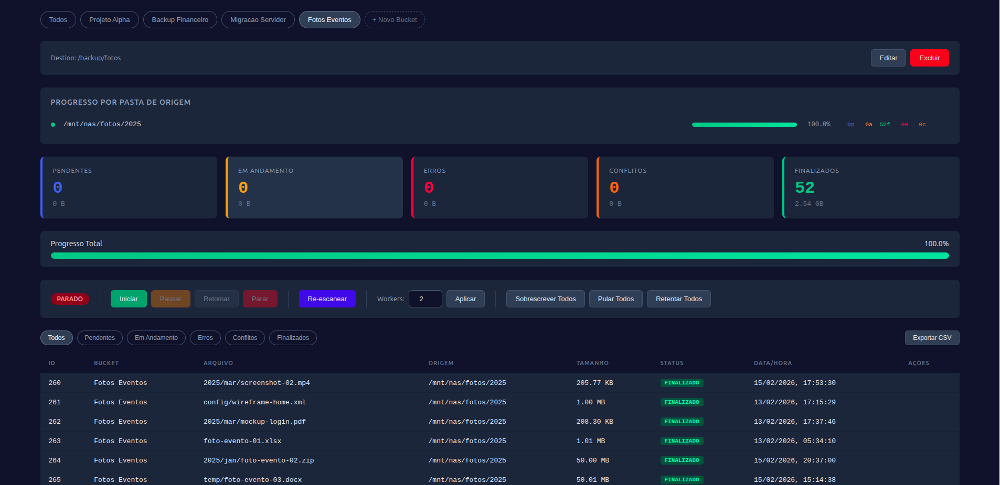

# File Copy Manager

Sistema de copia gerenciada de arquivos em Node.js. Copia arquivos de N pastas de origem para 1 pasta de destino, com fila de processamento, dashboard web em tempo real, logging multicanal e persistencia contra quedas de energia.



## Funcionalidades

- **Buckets independentes** -- agrupe copias em buckets com pastas de origem e destino proprias
- **Fila persistente** -- toda a fila vive em SQLite (modo WAL), resistente a quedas de energia
- **Copia via streams** -- `createReadStream` / `createWriteStream` com calculo de hash SHA-256 durante a leitura
- **Verificacao de integridade** -- apos copiar, compara hash da origem com o do destino
- **Deteccao de conflitos** -- se o arquivo ja existe no destino com hash diferente, marca como conflito para decisao manual
- **Workers paralelos** -- pool de workers async configuraveis em tempo real (1 a 16 por bucket)
- **Dashboard em tempo real** -- SPA em HTML/CSS/JS vanilla com atualizacoes via WebSocket
- **Logging multicanal** -- cada operacao grava no log geral e no canal especifico do status, com rotacao por tamanho
- **Recuperacao de crash** -- ao iniciar, reverte `in_progress` para `pending` e restaura o estado do servico
- **API REST documentada** -- Swagger UI disponivel em `/api/docs`
- **Exportacao CSV** -- exporte arquivos filtrados por status

## Screenshots

| Visao por bucket | Criacao de bucket | Bucket finalizado |
|---|---|---|
|  |  |  |

## Requisitos

- Node.js >= 20
- npm

## Instalacao

```bash
git clone <url-do-repositorio>
cd file-copy-manager
npm install
```

## Uso

```bash
npm start
```

O dashboard fica acessivel em `http://localhost:3020`.

### Variaveis de ambiente

Copie o `.env.example` e ajuste conforme necessario:

```bash
cp .env.example .env
```

| Variavel | Padrao | Descricao |
|---|---|---|
| `PORT` | `3020` | Porta do servidor HTTP |
| `HOST` | `0.0.0.0` | Host de bind |
| `WORKER_DEFAULT_COUNT` | `4` | Workers paralelos por bucket |
| `WORKER_MAX_COUNT` | `16` | Maximo de workers permitido |
| `LOG_DIR` | `./logs` | Diretorio dos logs |
| `LOG_MAX_SIZE` | `10M` | Tamanho maximo por arquivo de log |
| `LOG_MAX_FILES` | `50` | Quantidade maxima de arquivos de log |
| `DB_PATH` | `./data/queue.db` | Caminho do banco SQLite |
| `HASH_ALGORITHM` | `sha256` | Algoritmo de hash para integridade |
| `SCANNER_RECURSIVE` | `true` | Varredura recursiva de subdiretorios |
| `RATE_LIMIT_WINDOW_MS` | `60000` | Janela do rate limit (ms) |
| `RATE_LIMIT_MAX` | `200` | Maximo de requisicoes por janela |
| `REQUEST_LOG_FORMAT` | `short` | Formato do log de requisicoes (morgan) |

## Docker

```bash
docker compose up -d
```

O `docker-compose.yml` ja monta volumes para persistencia do banco e dos logs. Ajuste o mapeamento de volumes para expor as pastas de origem/destino ao container:

```yaml
volumes:
  - /caminho/local/origem:/mnt/storage
```

## Estrutura do projeto

```
file-copy-manager/
├── src/
│   ├── index.js                  # Entry point, shutdown graceful
│   ├── config.js                 # Configuracoes centralizadas via env
│   ├── api/
│   │   ├── index.js              # Express + WebSocket
│   │   ├── middleware.js          # Validacao, error handler
│   │   └── openapi.json          # Spec OpenAPI 3.0
│   ├── buckets/
│   │   └── manager.js            # Gerenciamento de buckets e pools
│   ├── errors/
│   │   └── index.js              # Classes de erro customizadas
│   ├── logger/
│   │   └── index.js              # Log multicanal com rotacao
│   ├── queue/
│   │   └── database.js           # SQLite (schema, CRUD, crash recovery)
│   ├── scanner/
│   │   └── index.js              # Varredura async das pastas de origem
│   ├── services/
│   │   ├── bucket-service.js     # Logica de negocio de buckets
│   │   ├── file-service.js       # Operacoes sobre arquivos na fila
│   │   ├── health-service.js     # Health check e metricas
│   │   ├── scanner-service.js    # Orquestracao de varredura
│   │   └── service-control-service.js  # Start/pause/resume/stop
│   ├── validation/
│   │   └── schemas.js            # Schemas Zod
│   └── workers/
│       └── index.js              # Pool de workers async
├── public/
│   └── index.html                # Dashboard SPA (dark theme)
├── test/
│   ├── unit/                     # Testes unitarios
│   ├── integration/              # Testes de integracao
│   └── helpers/                  # Fixtures e setup
├── docs/                         # Screenshots
├── logs/                         # Gerado automaticamente
├── data/                         # Gerado automaticamente (queue.db)
├── Dockerfile
├── docker-compose.yml
├── .env.example
└── package.json
```

## Status da fila

| Status | Significado |
|---|---|
| `pending` | Aguardando processamento |
| `in_progress` | Sendo copiado por um worker |
| `completed` | Copia finalizada com sucesso |
| `error` | Falha na copia |
| `conflict` | Arquivo existe no destino com hash diferente |

## API

A documentacao interativa da API esta disponivel em `/api/docs` (Swagger UI).

Principais endpoints:

| Metodo | Rota | Descricao |
|---|---|---|
| `GET` | `/api/health` | Health check |
| `GET` | `/api/metrics` | Metricas do sistema |
| `GET` | `/api/buckets` | Listar buckets |
| `POST` | `/api/buckets` | Criar bucket |
| `PUT` | `/api/buckets/:id` | Atualizar bucket |
| `DELETE` | `/api/buckets/:id` | Excluir bucket |
| `GET` | `/api/buckets/:id/stats` | Estatisticas do bucket |
| `GET` | `/api/buckets/:id/files/:status` | Arquivos por status |
| `POST` | `/api/buckets/:id/scan` | Iniciar varredura do bucket |
| `POST` | `/api/buckets/:id/service/start` | Iniciar servico de copia |
| `POST` | `/api/buckets/:id/service/pause` | Pausar servico |
| `POST` | `/api/buckets/:id/service/resume` | Retomar servico |
| `POST` | `/api/buckets/:id/service/stop` | Parar servico |
| `POST` | `/api/buckets/:id/service/workers` | Alterar numero de workers |
| `POST` | `/api/buckets/:id/conflicts/:fileId/resolve` | Resolver conflito |
| `POST` | `/api/buckets/:id/errors/:fileId/retry` | Retentar erro |
| `POST` | `/api/scan` | Varredura global (todos os buckets) |
| `GET` | `/api/stats` | Estatisticas globais |

## Testes

```bash
npm test                # todos os testes
npm run test:unit       # somente unitarios
npm run test:integration # somente integracao
```

## Scripts disponiveis

```bash
npm start          # Inicia o servidor
npm test           # Roda todos os testes
npm run lint       # Verifica estilo de codigo
npm run lint:fix   # Corrige problemas de lint automaticamente
npm run format     # Formata codigo com Prettier
```

## Licenca

Projeto privado.
